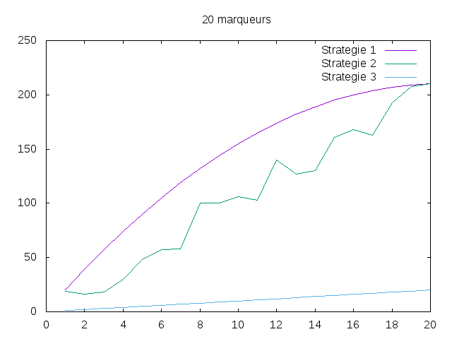
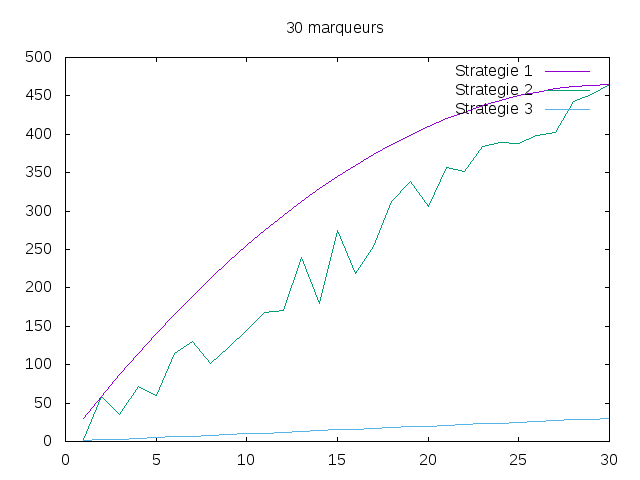
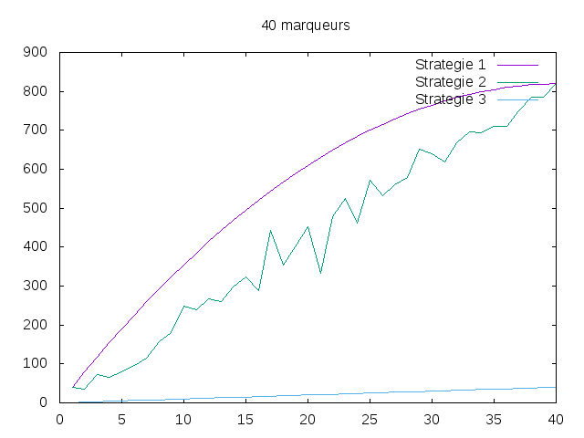
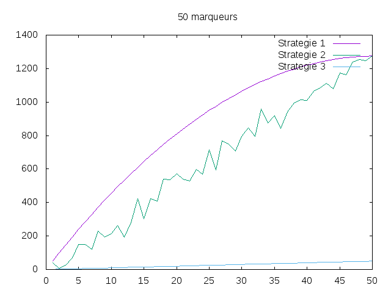
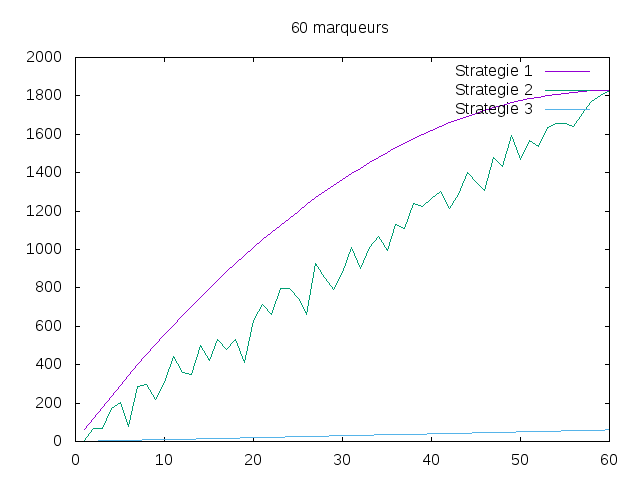
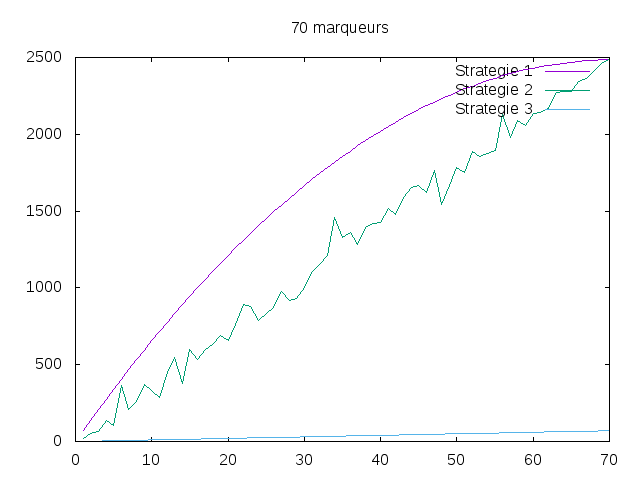
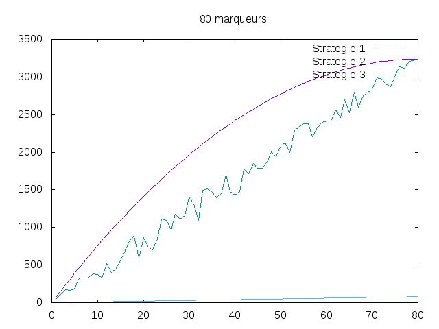
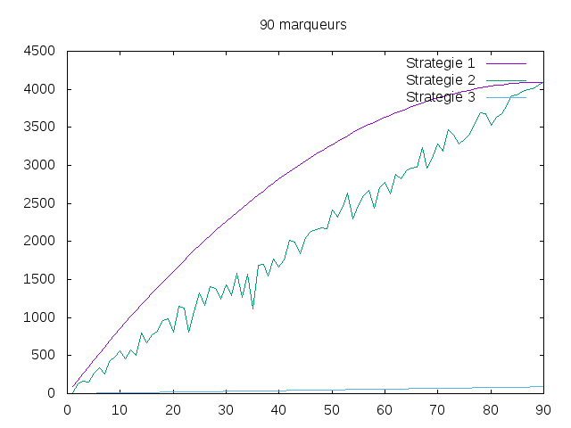
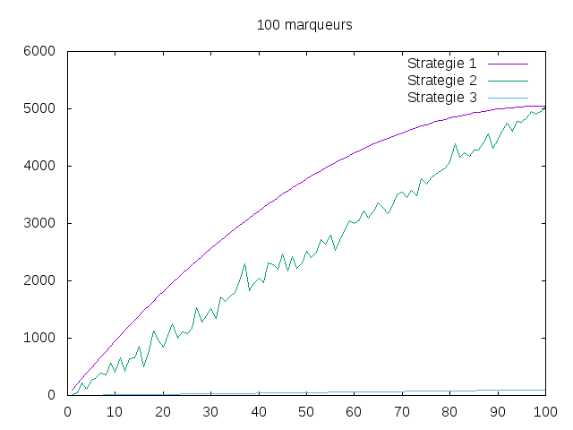

---------------
Experimentateur
---------------

.. toctree::
   :maxdepth: 1

   experience.rst

~~~~~~~~~~
Etat du TP
~~~~~~~~~~

Décrivez ici l'état d'avancement du TP.

~~~~~~~~~~~~~~~~~~~~~~
Réponses aux questions
~~~~~~~~~~~~~~~~~~~~~~

Indiquez ici les réponses aux questions posées dans le TP. Vous
reprendrez le numéro de la section et le numéro de la question. Par
exemple pour répondre à la question 3 de la section 2.4 vous
indiquerez.

   
Question 1.2.2
--------------

Pour étudier la complexité de cet algorithme, on se propose de compter le nombre de comparaisons du même type,
ici donc le nombre de comparaisons entre deux marqueurs, l'un non défini(liste m) et l'autre positif(liste p).

Question 1.2.3
--------------

Il n'y a qu'un cas général ici. 
Les marqueurs non positifs parcourent l'ensemble des marqueurs positifs
Les marqueurs positifs s'arrêtent lorsqu'ils sont trouvés

Lors d'un parcours exhaustif, l'ordre importe donc peu.

Question 1.2.4
--------------

OP=m+(m-1)+(m-2)...+(m-p)

Question 1.3.2
--------------
Le pire des cas ici serait que les marqueurs positifs soient les plus grands marqueurs.
Les marqueurs parcourent l'ensemble des marqueurs positifs tant qu'ils sont inférieurs aux marqueurs positifs restants.
Les marqueurs positifs s'arrêtent lorsqu'ils sont trouvés, ici donc le plus loin possible serait le pire des cas.

Question 1.4.2
--------------

Il n'y a qu'un seul cas général, puisque le parcours est linéaire (une seule comparaison par marqueur).
OP=m

Question 1.5.2
--------------

m=10
p=2

Pour la v1, le parcours est intégral
Pour la v2, cela dépend des valeurs de p
Pour la v3, chaque marqueur est comparé une fois

ce qui donne OP1>=OP2>=OP3

Question 1.5.6
--------------

.. _fig:tp1-10.png:

.. _fig:tp1-20.png:

.. _fig:tp1-30.png:

.. _fig:tp1-40.png:

.. _fig:tp1-50.png:

.. _fig:tp1-60.png:

.. _fig:tp1-70.png:

.. _fig:tp1-80.png:

.. _fig:tp1-90.png:

.. _fig:tp1-100.png:

On peut en tirer que les comportements sont sensiblement les mêmes, et que
v3>v2>v1 en terme d'optimalité.
