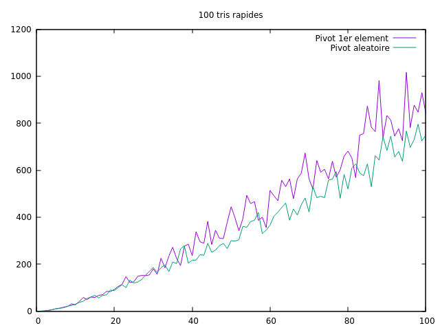
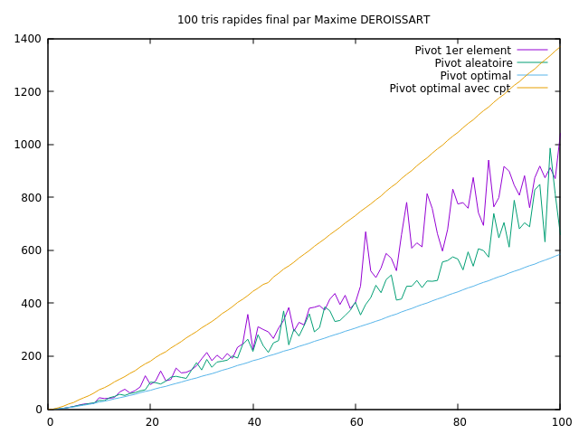

---------
Quicksort
---------

.. toctree::
   :maxdepth: 1

   modules.rst

~~~~~~~~~~
Etat du TP
~~~~~~~~~~

Décrivez ici l'état d'avancement du TP.

~~~~~~~~~~~~~~~~~~~~~~
Réponses aux questions
~~~~~~~~~~~~~~~~~~~~~~

Indiquez ici les réponses aux questions posées dans le TP. Vous
reprendrez le numéro de la section et le numéro de la question. Par
exemple pour répondre à la question 3 de la section 2.4 vous
indiquerez.

   
Question 2.2.1
--------------

- Le tri à bulles
- Le tri par sélection
- Le tri par insertion

Question 2.2.3
--------------

Afin de déterminer que le partitionnement est correctement réalisé, il faut :

1) Que la longueur des deux partitions soit égale à celle du tableau (initial) passé en paramètre

2) Que le premier élément (le pivot) de la deuxième liste partitionné soit strictement supérieur à 

tous ceux de la première liste, mais aussi inférieur ou égal aux éléments de la seconde.

Question 2.2.8
--------------

Dans le cas où le tableau est déjà trié, c'est-à-dire le pire des cas du tri rapide, le nombre de tableau est proportionnel à sa taille, soit n.

Lorsqu'on utilise le tri sur place, aucun espace supplémentaire n'est requis (on déplace les éléments au sein même du tableau, sans en créer de nouveau.
Peut-être que la permutation d'élements nécessite une allocation temporaire d'espace mémoire, mais ce n'est pas vraiment le sujet).

Question 2.3.1.4
----------------

.. _fig:tp1-10.png:

Comme nous le constatons, même si les résultats sont similaires à petite échelle, l'écart se creuse entre les deux types de sélections à mesure de l'augmentation
de la taille du tableau. Il y a en effet moins de comparaison lorsque le pivot est
choisi aléatoirement.

Question 2.3.1.5
----------------
L'équation de récurrence est la suivante:

u0=1
un=n+u ind(n-1)

L'équation du pire des cas pour le tri rapide est lorsque la valeur
du pivot est maximale ou minimale. En effet, il y aura à chaque étape du tri rapide n+(n-1)+(n-2)..+ 1 comparaisons, ce qui tend vers n² et donne ainsi une complexité en O(n²)

Question 2.3.2.1
----------------

La meilleur valeur théorique pour le pivot devrait être la valeur médiane du tableau.
Cela permettrait en effet de trier deux sous tableaux de taille similaire, et ainsi
réduire le nombre de comparaisons.

Question 2.3.2.4
----------------

.. _fig:tp1-10.png:

                                                                              
Question 2.3.2.5
----------------

L'équation de récurrence est la suivante:

u0=1
un=n + 2 * u ind(n/2)

L'équation du meilleur des cas pour le tri rapide est lorsque la valeur
du pivot est la valeur médiane (crée deux sous tableaux de taille égale).
Cela donnera un nombre de comparaisons en n*log2(n)+n

            
Question 2.3.2.2.1
------------------

Non, cela devient même le pire, étant donné que pour rechercher le meilleur pivot,
on parcourt l'ensemble du tableau, ce que fait par défaut le pire cas du tri rapide.

